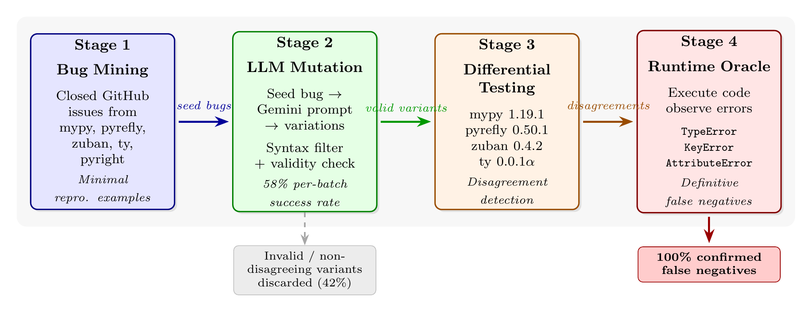

# Methods

## Overview and System Architecture

Pytifex employs a four-stage pipeline to systematically generate test cases that expose type checker bugs: (1) mining bug reports from type checker repositories, (2)
LLM-based mutation to generate semantically similar variations, (3) differential testing across multiple type checkers to identify disagreements, and (4) runtime validation
to establish ground truth.
Figure 3.1 illustrates this architecture.


**Figure 3.1:** Pytifex system architecture. Seed bugs mined from closed GitHub issues are mutated by Gemini to produce semantically similar variants that may trigger related
failures across different type checkers. Valid variants are tested across four type checkers to identify disagreements. Disagreement-triggering programs are executed at
runtime; `TypeError`, `KeyError`, or `AttributeError` constitutes definitive evidence of a false negative. The pipeline guarantees that 100% of final outputs are confirmed
false negatives.

The pipeline's design reflects two key insights from our analysis of related work. First, differential testing alone cannot determine which type checker is correct when
disagreements occur—it only signals that at least one implementation is wrong. Second, historical bug reports encode precisely which language features and type constructs
tend to trigger checker failures, making them valuable seeds for generating new test cases.

## Mining Type Checker Bug Reports

Pytifex mines seed bugs from five type checker repositories: mypy, pyrefly, zuban, ty, and pyright. Unlike static corpus approaches that perform one-time bulk scraping, each
pipeline run queries up to 100 candidate issues per repository, sorted by most recent update. This recency-biased sampling means the seed pool shifts naturally as
repositories evolve—recently closed bugs enter the query window while older issues fall out—allowing Pytifex to incorporate emerging patterns without manual curation. The
same issue may be mined across multiple runs, but the most recent bugs are consistently prioritized.

### Mining Process

Pytifex queries the GitHub REST API for closed issues labeled as bugs from each repository, sorted by most recent update. This retrieves up to 100
candidates per repository. We then apply post-fetch filtering to ensure seed quality:

**Bug confirmation filtering**. Issues closed as "not planned" are excluded—these represent wontfix decisions, duplicates, or reports that maintainers determined were not
actual bugs. Only issues closed with resolutions indicating a genuine bug fix are retained.

**Code extraction**. From the remaining issues, we extract Python code blocks. An issue contributes a seed example if its body contains either a fenced code block (`python`
or `py`) or, for Pyrefly, a sandbox URL encoding executable Python. We require at least 50 characters to exclude trivial snippets while permitting the minimal reproducible
examples typical of well-filed bug reports.

**Sampling**. After shuffling the filtered issues, we extract up to 5 code examples per repository. A single issue may contain multiple code blocks; our limit applies to
extracted examples, not issues. This multi-stage filtering reduces each repository's candidates to a handful of seeds, yielding approximately 10–25 total seed examples per
pipeline run across all five repositories, with variation depending on repository maturity and the prevalence of extractable code in bug reports.

The recency bias serves a deliberate purpose: recently closed bugs tend to exercise newer language features (e.g., PEP 695 type parameter syntax, PEP 742 TypeIs) that are
more likely to expose disagreements in less mature type checkers. This seed-based mutation strategy draws on FuzzGPT [Deng et al., 2024], which demonstrated that LLMs primed
with historical bug-triggering code generate significantly more edge-case programs than zero-shot generation.

## Illustrative Example: From Mined Seed to New Finding

To demonstrate the pipeline end-to-end, we trace one seed from mining through mutation to a confirmed type checker bug.

Code Listing 3.1(a) shows the original seed, mined from mypy issue #18524. The bug report described a false positive in mypy 1.14.1: mypy incorrectly marked match arms as
unreachable when pattern matching on type objects with `--warn-unreachable` enabled. The code is valid Python that executes without error at runtime—mypy's diagnostic was
wrong. (This bug has since been fixed; the original false positive required the `--warn-unreachable` flag.)
**Code Listing 3.1(a): Original seed from mypy #18524 (false positive).**
```{python}
import builtins
import types

def frobulate(field_type: type) -> str:
    match field_type:
        case builtins.int:
            ret = "foo"
        case builtins.str:    # mypy: "Statement is unreachable"
            ret = "foo"
        case builtins.bytes:
            ret = "foo"
        case builtins.bool:
            ret = "foo"
        case types.NoneType:
            ret = "foo"
        case _:
            return "bar"
    return ret
```

Given this seed, the LLM generated a variation that explores a different construction in the same feature area: matching on `type()` with positional sub-patterns, combined
with generics and the `Self` type.

**Code Listing 3.1(b): LLM-generated variation (adapted for presentation).**
```{python}
from typing import TypeVar, Self, Union, Any
import copy

T = TypeVar("T")

class Box[T]:
    def __init__(self, value: T) -> None:
        self.value = value

    def copy(self) -> Self:
        return type(self)(copy.deepcopy(self.value))

    def unwrap(self) -> T:
        return self.value

class IntBox(Box[int]):
    def double(self) -> Self:
        return type(self)(self.value * 2)

class StrBox(Box[str]):
    def upper(self) -> Self:
        return type(self)(self.value.upper())

def inspect_box_return(box_instance: Union[Box[Any], IntBox, StrBox]) -> str:
    copied_box = box_instance.copy()

    match type(copied_box):
        case type(IntBox(0)):   # TypeError at runtime
            return f"Copied an IntBox. Value: {copied_box.unwrap() * 3}"
        case type(StrBox("")):
            return f"Copied a StrBox. Value: {copied_box.unwrap().lower()}"
        case type(Box(None)):
            return f"Copied a generic Box. Value: {copied_box.unwrap()}"
        case _:
            return f"Unknown Box type: {type(copied_box).__name__}"

if __name__ == "__main__":
    print(inspect_box_return(IntBox(5)))   # Crashes here
```

Unlike the original seed, which was valid code that mypy incorrectly rejected, the variation contains a genuine bug: `case type(IntBox(0))` attempts to match on `type()` with
a positional sub-pattern, but `type` does not define `__match_args__`. Python's runtime raises `TypeError: type() accepts 0 positional sub-patterns (1 given)` on every
execution.

When tested across four type checkers, mypy, pyrefly, and zuban all correctly rejected the code, reporting that `type` does not define `__match_args__`. However, ty accepted
the code, emitting only an unrelated warning about a possibly missing attribute. This constitutes a false negative: ty missed a bug that crashes deterministically at runtime.
The pipeline's Tier 1 evaluation (Section 3.X) confirmed this verdict automatically with confidence 0.95.

This example illustrates a key property of seed-based mutation: the LLM did not reproduce the original false positive. Instead, it explored a related construction in the
match-on-types feature space that exposed a different deficiency—a false negative in a different checker. The pipeline's value lies not in replicating known bugs but in using
them as starting points to discover new ones.

## LLM-Based Test Case Generation

Pytifex uses the mined seed examples to construct prompts that guide an LLM toward generating code likely to cause type checker disagreements. Rather than asking the LLM to
generate test cases from scratch—which tends to produce ordinary programs that all checkers handle identically [Deng et al., 2023]—we prime it with real bug-triggering code
and explicit divergence targets.

### Prompt Construction

Each generation prompt contains three components:

- 1 **Seed examples**. Up to 5 code examples from the mined seed pool, each annotated with its source repository, issue number, labels, and whether the original bug was a
false positive or false negative. This metadata helps the LLM understand why each seed triggered a bug, not just what the code does.

- 2 **Divergence patterns**. A curated set of feature interaction patterns known to cause checker disagreements, such as Protocol methods with default arguments (PEP 544),
TypedDict with mixed Required/NotRequired inheritance (PEPs 589, 655), and ParamSpec applied to classmethods (PEP 612). These patterns serve as additional generation targets
beyond what the seeds demonstrate.

- 3 **Mutation strategy**. Explicit instructions to mutate seeds into novel variations, not reproduce them: combine orthogonal patterns (e.g., TypedDict + Protocol),
perturb seeds by changing types, adding generics, or wrapping in decorators, and probe the boundaries of what checkers catch. If a seed shows a false positive, the LLM is
instructed to mutate it toward cases that other checkers also mishandle; if a seed shows a false negative, to explore the detection boundary.

Every generated example is required to reference a specific seed issue, establishing provenance from the generated test case back to the real bug that inspired it. Examples
without valid provenance are discarded.

### Mutation-Filter Loop

The pipeline operates in a mutation-filter loop, iterating until a target number of disagreements is reached or a maximum number of attempts is exhausted. Each iteration
proceeds as follows:

- 1 **Mutate**. The LLM produces a batch of candidate programs (default: 15 per batch) by mutating the seed examples according to the prompt. Successive batches use a
rotating window over the seed pool so that different batches draw on overlapping but distinct seed subsets, promoting diversity across iterations.

- 2 **Test**. Each candidate is written to a temporary file and executed sequentially by all four type checkers with default configurations and a 30-second timeout. The
checker's exit code and output are recorded.

- 3 **Filter**. A candidate exhibits a disagreement if at least one checker's status differs from another's. Formally, let S = {s₁, s₂, s₃, s₄} be the set of checker
statuses, where each sᵢ ∈ {ok, error}. A disagreement exists when |S| > 1 — that is, not all checkers agree. For example, if mypy, pyrefly, and zuban report error but ty
reports ok, the candidate is a disagreement. Candidates where all four checkers agree are discarded.

- 4 **Refine**. Examples that pass through the Filter step without exhibiting a disagreement—where all four checkers reported the same status—undergo up to two refinement
attempts. The refinement prompt includes the example's source code and the actual output from each checker, asking the LLM to minimally modify the code to induce a
disagreement. Strategies include adding a subtle type error that only some checkers catch, fixing an obvious error while preserving a subtle edge case, or changing the typing
pattern (e.g., introducing a Protocol or TypeGuard). Refinement is iterative: if the first attempt does not produce a disagreement, the second attempt refines the output of
the first, giving the LLM two incremental adjustments rather than two independent attempts on the original. If neither attempt produces a disagreement, the example is
discarded.

This closed-loop design—where checker feedback drives subsequent mutation—distinguishes Pytifex from one-shot generation approaches. The refinement step recovers value from
candidates that would otherwise be discarded: across our evaluation runs, approximately 71% of generated candidates exhibited disagreements, with refinement contributing a
portion of the successful examples.

## Saving Code Examples

When the mutation-filter loop completes, Pytifex persists all disagreement-triggering examples to disk in a timestamped directory under `generated_examples/`. Each disagreement is saved as a
standalone `.py` file containing the generated source code, and a companion `results.json` records the full pipeline run: the model used, the total number of candidates generated, the number of
disagreements found, the per-batch success rate, and for each disagreement the raw output and status (`ok` or `error`) from every type checker. This structured output serves two purposes: it
provides a reproducible artifact for subsequent evaluation, and it preserves the provenance chain from mined seed to generated variant to checker outcome.

The results JSON also records the `seed_issue` field for each disagreement—the GitHub issue URL that inspired the generated code—enabling traceability from a confirmed finding back through the
LLM mutation to the original bug report. Examples that lack a valid `seed_issue` reference are discarded during generation, ensuring that every saved disagreement has documented provenance.

## Establishing Ground Truth: The Evaluation Oracle

Differential testing identifies disagreements but cannot determine which checker is correct. A critical question remains: when mypy reports `ok` and ty reports `error`, which one is right? To
answer this, Pytifex employs a multi-tiered evaluation system that combines runtime execution, property-based testing, AST-level specification analysis, and static flow analysis to establish
ground truth with varying degrees of confidence.

The evaluation system processes each disagreement through multiple independent oracles, each contributing evidence toward a final verdict per checker. The tiers are not sequential filters—all
tiers run on every disagreement, and their findings are aggregated by a priority-based verdict determination function that resolves conflicts by preferring higher-confidence evidence.

### Tier 0: AST-Based PEP Oracle

Tier 0 performs source-level AST analysis to identify definitive violations of Python typing PEP specifications, independently of any type checker output. The oracle parses the generated source
code and applies a battery of rule-based checks derived from PEPs 484, 526, 544, 586, 589, 591, 612, 634, 646, 647, 655, 673, 692, 695, 696, 698, 705, and 742. Each rule targets a specific
construct—for example, `TDICT003` flags direct access to a `NotRequired` TypedDict field without a membership check (PEP 589), `FINAL003` detects overriding a `@final` method in a subclass
(PEP 591), and `LSP001` identifies Liskov Substitution Principle violations in method overrides (PEP 484).

Each finding carries a confidence score; only findings with confidence ≥ 0.85 are retained. The oracle then evaluates each type checker by parsing its raw output into structured diagnostics
(line number, error code, message, severity) and matching them against the oracle's findings. A finding is considered matched if the checker reported an error within 5 lines of the violation and
the error code or message keywords correspond to the violation category. The verdict logic is:

- **CORRECT**: All oracle findings matched by checker diagnostics.
- **INCORRECT**: One or more findings not reported by the checker (false negative).
- **UNCERTAIN**: No oracle findings exist, or upstream checker errors may have blocked detection of the violation.

The oracle's strength lies in its independence: it derives ground truth from PEP specifications rather than from checker consensus, avoiding the circularity of using checkers to validate
themselves. However, it is limited to constructs with unambiguous specification-level rules and cannot evaluate advanced features like `TypeGuard`, `ParamSpec`, or `TypeVarTuple`, which require
semantic reasoning beyond AST pattern matching.

### Tier 1: Runtime Crash Detection

Tier 1 executes the generated code and catches type-related runtime exceptions—`TypeError`, `KeyError`, and `AttributeError`. A runtime crash constitutes the highest-confidence evidence of a
type bug: if code raises `TypeError` at runtime, any type checker that reported `ok` is definitively incorrect (a false negative). This oracle is asymmetric—it can prove false negatives but
cannot prove false positives—because code may run successfully without exercising every type-incorrect path.

The implementation goes beyond naive execution in three ways. First, it walks the full traceback to identify the root-cause line, not just the final frame, attributing the bug to the line in the
generated source where the type violation originates rather than to library internals. Second, it inspects exception chains via `__cause__` and `__context__`, surfacing chained type errors that
would otherwise be masked. Third, it isolates `try/except` bodies by extracting them via AST analysis and re-executing them independently. This surfaces type errors that the original code
deliberately swallows—a common pattern in generated code where `try/except Exception` blocks mask `TypeError` or `KeyError` exceptions that should propagate. Bugs discovered through isolation
receive a slightly reduced confidence of 0.95 (versus 1.0 for direct crashes) to reflect the contextual difference.

### Tier 2: Hypothesis Property-Based Testing

Tier 2 employs Hypothesis, a property-based testing framework, to exercise code paths that Tier 1's single execution may not reach. Rather than relying on the `if __name__ == "__main__"` block
alone, Tier 2 systematically generates inputs for every user-defined function and class method in the generated code.

The process operates in five steps:

- 1 **Definition extraction**. The AST is parsed to identify all user-defined functions, constructors, and methods. Built-in names, dunder methods, and private functions are excluded to focus
on the code's public API.

- 2 **Namespace construction**. The source code is executed once with `__name__` set to a non-`"__main__"` value, building a live namespace containing all defined classes and functions. This
step is necessary because Hypothesis requires callable objects, not AST nodes.

- 3 **Signature introspection**. For each callable, Python's `inspect.signature` and `typing.get_type_hints` extract parameter types and return annotations. These concrete type hints are
mapped to Hypothesis strategies—`int` maps to `st.integers()`, `str` to `st.text()`, `list[int]` to `st.lists(st.integers())`, and so on. Parameters with `ParamSpec` components or
unresolvable types are skipped rather than generating arbitrary values.

- 4 **Property test execution**. Each callable is tested with `@given` decorators using the generated strategies. The property under test is that calling the function with type-conforming
inputs should not raise `TypeError`, `KeyError`, or `AttributeError`. Hypothesis runs up to 30 examples per callable with no deadline, allowing slow-executing generated code to complete.

- 5 **Return type validation**. When a function declares a return type and the `typeguard` library is available, return values are validated against their declared type annotation, catching
cases where a function's implementation silently returns an incompatible type.

Tier 2 also includes targeted tests that exercise specific call sites found in the source code's `if __name__ == "__main__"` block and class method chains, using AST analysis to construct
invocation sequences that mirror the code's intended usage patterns.

Bugs discovered by Hypothesis receive confidence 0.85, reflecting that they are genuine runtime failures triggered by valid inputs, though the inputs are synthetically generated rather than
reflecting the code's original execution path.

### Tier 3: PEP Specification Compliance

Tier 3 applies a curated set of PEP-derived rules to each checker's output, determining whether the checker's behavior aligns with the official Python typing specifications. Unlike Tier 0,
which analyzes the source code independently, Tier 3 examines the checker outputs themselves—matching their error messages against regex patterns derived from specific PEP requirements.

The rule set covers 24 PEPs and encompasses patterns including method override compatibility (PEP 484), protocol instantiation (PEP 544), `Final` reassignment and subclassing (PEP 591),
`TypedDict` key requirements (PEPs 589, 655), `ParamSpec` and `Concatenate` usage (PEP 612), `TypeGuard` and `TypeIs` semantics (PEPs 647, 742), and `ReadOnly` TypedDict fields (PEP 705).

For each rule, the evaluator checks whether the checker's output contains a matching error message and whether the checker's overall status (error or ok) agrees with the PEP's prescribed
behavior. For example, if PEP 591 specifies that reassigning a `Final` variable should produce an error, and mypy reports such an error while ty does not, mypy is marked correct and ty
incorrect for that rule. Tier 3 also incorporates a source-aware analysis pass that uses the AST oracle findings from Tier 0 and checks whether each checker reported errors near the identified
violation lines, providing an independent cross-check.

Module import errors and `reveal_type` diagnostics are filtered out to avoid false matches—these are tool-specific behaviors unrelated to type correctness.

### Tier 4: Static Flow Analysis and Design Differences

When Tiers 0–3 leave a checker's verdict uncertain, Tier 4 performs additional static analysis covering constructs that earlier tiers cannot evaluate. This includes import availability checks
(whether a typing construct like `TypeIs` or `ReadOnly` is available in the target Python version or requires `typing_extensions`), variance constraint analysis, type narrowing flow through
`TypeIs`/`TypeGuard`/`isinstance`/`match` statements, nominal type boundary enforcement for `NewType`, and match exhaustiveness verification.

Cases that remain uncertain after all four tiers represent genuine design differences between type checkers—areas where the Python typing specification is ambiguous or where checkers make
legitimately different approximation choices. These are documented as `UNCERTAIN` rather than forced into a potentially incorrect verdict.

### Verdict Determination

The final verdict for each checker on each disagreement is determined by a priority function that aggregates evidence from all tiers. The priority order is:

- 1 **Tier 1** (runtime crashes): If proven runtime bugs exist, checkers that caught them are `CORRECT`; checkers that missed them are `INCORRECT` with confidence 0.95.
- 2 **Tier 0** (AST oracle): If the oracle produced non-uncertain findings, its verdict is adopted with the oracle's confidence score.
- 3 **Tier 2** (Hypothesis): If property-based testing found bugs, checkers are evaluated against the bug locations with confidence 0.85.
- 4 **Tier 3** (PEP compliance): If PEP rules matched, the checker's compliance is scored with confidence 0.80.
- 5 **Tier 4** (static analysis): Remaining verdicts from static flow analysis, accepted at confidence ≥ 0.80.
- 6 **False positive detection**: If no tier found any violations and the oracle confirmed the source is violation-free, but a checker still reports errors, that checker is marked `INCORRECT`
for producing false positives—provided the source does not use typing constructs beyond the oracle's coverage (e.g., `ParamSpec`, `TypeVarTuple`).

If no tier provides definitive evidence, the verdict is `UNCERTAIN` with confidence 0.5.

### Agent-Based Resolution of Uncertain Cases

For disagreements where all tiers yield `UNCERTAIN`, Pytifex optionally invokes the Gemini LLM as a final arbiter. The agent receives the source code, the target checker's output, and all
other checkers' outputs, and is asked to determine whether the checker's behavior is `CORRECT`, `INCORRECT`, or `UNCERTAIN`, citing the specific PEP section that supports its verdict. The
agent's response is parsed for a structured JSON verdict; if parsing fails, the system falls back to extracting the verdict from prose. Agent-resolved verdicts are reported separately from
tier-based verdicts, maintaining a clear distinction between deterministic evaluation and LLM-based judgment.

## Implementation

Pytifex is implemented in Python 3.12 and uses the Google Gemini API (via `httpx`) for LLM-based code generation and agent-based evaluation. The pipeline is orchestrated by a command-line
interface that supports four modes: `full` (generation + evaluation), `generate` (generation only), `check` (run type checkers on existing examples), and `eval` (evaluate existing results).
Type checkers are invoked via `subprocess` with a 30-second timeout per file, using their default configurations. The tool depends on `hypothesis` and `typeguard` for Tier 2 property-based
testing, and on `beartype` for supplementary runtime type enforcement.

All type checker outputs are real—they come from actual tool execution on the local system, not LLM simulation. The LLM is used exclusively for two purposes: generating candidate code from
seed examples, and resolving uncertain verdicts in the agent-based fallback. The evaluation tiers (0–4) are entirely deterministic and reproducible.

The tool is released as open source at [https://github.com/benedekaibas/pytifex-demo], enabling reproduction of our results and future research on type checker validation.

